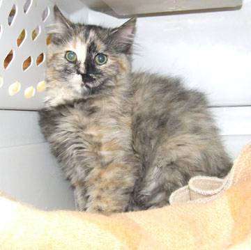

# Cat Vs Dog Classification Model

## Introduction

The classification of cats and dogs from images is a classic problem in computer vision and machine learning. In this report, we present the implementation of a convolutional neural network (CNN) using TensorFlow for classifying images of cats and dogs. The model architecture is defined, trained, and evaluated using a dataset consisting of images of cats and dogs.

## Model Architecture

The CNN model consists of several layers designed to extract relevant features from input images and classify them into two classes: cat or dog. The architecture of the model is as follows:

1. Convolutional Layer: Consists of 32 filters of size 3x3 with ReLU activation.
2. MaxPooling Layer: Performs max pooling operation with a pool size of 2x2.
3. Convolutional Layer: Consists of 64 filters of size 3x3 with ReLU activation.
4. MaxPooling Layer: Performs max pooling operation with a pool size of 2x2.
5. Convolutional Layer: Consists of 128 filters of size 3x3 with ReLU activation.
6. MaxPooling Layer: Performs max pooling operation with a pool size of 2x2.
7. Convolutional Layer: Consists of 128 filters of size 3x3 with ReLU activation.
8. MaxPooling Layer: Performs max pooling operation with a pool size of 2x2.
9. Flatten Layer: Flattens the input into a 1D array.
10. Dense Layer: Consists of 512 neurons with ReLU activation.
11. Dropout Layer: Applies dropout regularization with a rate of 0.5.
12. Output Layer: Consists of 1 neuron with sigmoid activation, outputting the probability of the input image being a dog.


## Data Preparation

The dataset used for training and testing the model consists of two sets: a training set and a test set. The training set (`training_set`) contains labeled images of cats and dogs used for training the model, while the test set (`test_set`) contains images for evaluating the model's performance.

Data generators are utilized to preprocess the images and generate batches of data for training and testing. ImageDataGenerator class from Keras is used for data augmentation, which includes rescaling, shearing, zooming, and horizontal flipping of images. This helps in increasing the diversity of training samples and improving the generalization of the model.

## Model Training

The model is compiled using the Adam optimizer and binary cross-entropy loss function, which is suitable for binary classification tasks. Additionally, accuracy is chosen as the evaluation metric.

The model is trained using the `fit()` function, which takes the training data generator, the number of training steps per epoch, the number of epochs, the validation data generator, and the number of validation steps per epoch as inputs. During training, the model learns to classify images of cats and dogs by adjusting its weights based on the optimization algorithm and the feedback provided by the loss function.

## Model Evaluation

After training, the model is evaluated using the test set to assess its performance on unseen data. The evaluation metrics include accuracy, which measures the proportion of correctly classified images, and loss, which indicates the discrepancy between the predicted and actual labels.

## Input



## Output

```python
1/1 ━━━━━━━━━━━━━━━━━━━━ 0s 213ms/step
Prediction: Cat
```

## Conclusion

In conclusion, we have implemented a CNN-based classification model for distinguishing between images of cats and dogs. The model achieves promising results in terms of accuracy and loss on the test set. Further optimizations and fine-tuning can be explored to improve the model's performance and robustness for real-world applications.

## References

* *API Documentation | TensorFlow v2.16.1* . (n.d.). TensorFlow.* **https://www.tensorflow.org/api_docs**
* *Cat and Dog . (2018, April 26). Kaggle. ***https://www.kaggle.com/datasets/tongpython/cat-and-dog/data?select=test_set**
* Team, K. (n.d.).  *Keras documentation: Keras 3 API documentation* . **https://keras.io/api/**
